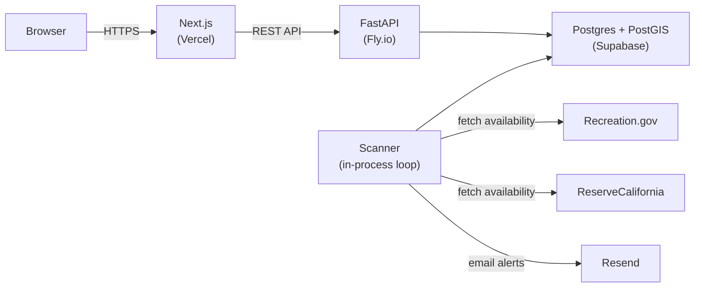

# CampScout

**Find available campsites before they're gone.**

## What it does

CampScout searches for campsite availability across Recreation.gov (national parks and national forests) and California state parks by location and dates -- something the official sites don't support well. Set a point on the map, pick your radius and dates, and see what's open. When a campground is fully booked, save it as a watch and get an email when a cancellation opens up. For ReserveCalifornia sites, CampScout detects locked cancellations and alerts you before the site unlocks.

## Architecture



The scanner runs as an in-process loop alongside the API. It writes availability snapshots to Postgres; search queries read from the database, never from upstream APIs.

## Key design decisions

- **PostGIS geographic search.** Campground locations are stored as PostGIS geography points. "Find campgrounds within 50 miles of Yosemite Valley" is a single `ST_DWithin` query.
- **Fan-in scanner pattern.** If 50 users watch the same campground for the same month, the scanner makes one API call, not 50. Scan jobs are keyed by `(facility_id, month)` with the interval set to the minimum across all watchers.
- **Cached availability.** Search reads from `current_availability` in Postgres. No upstream API calls happen in request handlers. Freshness comes from the scanner; the UI shows when each result was last updated.
- **Lock detection for ReserveCalifornia.** ReserveCalifornia puts cancelled sites into a "locked" state before releasing them. CampScout detects the lock and alerts users before the site becomes publicly available, giving them a head start.
- **Provider abstraction.** Each campsite system (Recreation.gov, ReserveCalifornia) implements a `Provider` interface. Adding a new state park system means adding one file in `providers/`.

## Tech stack

| Layer | Technology |
|---|---|
| Frontend | Next.js 15, TypeScript, Tailwind, shadcn/ui |
| Map | MapLibre GL JS, react-map-gl |
| Backend | Python 3.12, FastAPI, SQLAlchemy 2.x (async) |
| Database | Postgres 16 + PostGIS |
| Auth | Supabase Auth |
| Email | Resend |
| Scheduler | APScheduler (in-process) |
| Frontend hosting | Vercel |
| Backend hosting | Fly.io |
| DB hosting | Supabase |

## Running locally

**Prerequisites:** Docker, Python 3.12+, Node.js 20+, pnpm

```bash
# Start Postgres + Redis
docker compose -f infra/docker-compose.yml up -d

# API
cd apps/api
cp .env.example .env              # fill in RIDB_API_KEY, SUPABASE_URL, etc.
uv sync
alembic upgrade head
python -m campscout.seed.recreation_gov
python -m campscout.seed.reserve_california
uvicorn campscout.main:app --reload

# Frontend (separate terminal)
cd apps/web
cp .env.example .env.local        # fill in NEXT_PUBLIC_API_URL, Supabase keys
pnpm install
pnpm dev
```

The API runs on `localhost:8000`, the frontend on `localhost:3000`.

**Required env vars (API):** `DATABASE_URL`, `RIDB_API_KEY`, `SUPABASE_URL`, `RESEND_API_KEY`, `SCAN_USER_AGENT`

**Required env vars (Web):** `NEXT_PUBLIC_API_URL`, `NEXT_PUBLIC_SUPABASE_URL`, `NEXT_PUBLIC_SUPABASE_ANON_KEY`, `NEXT_PUBLIC_MAPTILER_API_KEY`

## Ethics

CampScout is an unofficial, open-source tool. It does not book campsites -- all reservations happen on the official provider websites. Scan intervals are set conservatively (15 minutes for watched sites, 6 hours for background coverage) to avoid burdening upstream systems. The scanner identifies itself via User-Agent and respects rate limits with exponential backoff. Reservation reselling and auto-booking are not supported.

## License

MIT
